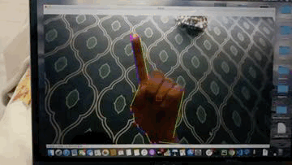

# Air Writing Recognition
A machine learning application in python for recognitzing characters written in the air with hand using image segmentation, contouring and convolutional neural network. It uses OpenCV and Pytorch libraries. 

Dataset : EMNIST letter dataset

### Action Keys :
s - Start finger detection

d - draw

c - clear drawing

p - predict the character

q - quit
